# Guide for Requesting Travel and Reimbursement in Concur

**Rutgers Travel Policy**: https://procurementservices.rutgers.edu/travel-and-expense  
**Questions**: RUTravel@finance.rutgers.edu

**Note**: For non-Rutgers employee travel, contact Denise (denise.fedele@rutgers.edu) and/or Nina (as5248@rwjms.rutgers.edu).

## Contents

- [Workflow When Planning a Business Trip](#workflow-when-planning-a-business-trip)
  - [Faculty Travelers](#faculty-travelers)
  - [Non-Faculty Travelers](#non-faculty-travelers)
- [Tutorials with Screenshots](#tutorials-with-screenshots)
  - [Creating and Submitting a Travel Request](#creating-and-submitting-a-travel-request)
  - [Creating and Submitting a Travel Report](#creating-and-submitting-a-travel-report)
  - [Creating a Non-Travel Reimbursement Report](#creating-a-non-travel-reimbursement-report)
- [Forms](#forms)

---

## Workflow When Planning a Business Trip

### Faculty Travelers

1. **Complete the departmental out of office form** (see [Forms](#forms)) to report the time you will be traveling.

2. **In Concur: complete a travel request** (see tutorial below).
   - The travel request will include dates of travel, location, anticipated expenses and the accounting codes for the fund covering the trip. Denise and Hillary can help with the codes.
   - The request goes to the appropriate accounting approvers who will verify the fund is appropriate and adequate.

3. **In Concur: book your travel**.
   - Once the travel request is approved, you may book your travel.
   - Flights must be booked online through Concur or through Direct Travel: (888) 818-1067, RutgersTravel@dt.com.
     - When booking with Direct Travel, they will ask for the 6-digit account number which is funding the trip (the same submitted in the travel request).
   - Hotel and car rentals can be booked through Concur, Direct Travel or independently.

4. **Take your trip**.
   - Save all receipts for which you expect reimbursement, like uber trips, public transportation expenses, registration fees, etc.
     - See https://procurementservices.rutgers.edu/travel-and-expense/reporting-travel-expenses for reimbursable expenses.
   - **Note**: Food will be covered by a per diem rate that will be calculated automatically when you add it to your reimbursement report.

5. **After the trip, submit your reimbursement report** (see tutorial below).
   - Open the approved travel request.
   - In the upper right corner click on "create report".
   - Add expenses and receipts as appropriate.
   - Submit report.

**Summary Workflow**:
- **For the Department**: Complete Out-Of-Office Form
- **In Concur**: Complete Travel Request
- **In Concur**: Book Your Travel
- **Take Your Trip**
- **In Concur**: Submit Your Report

### Non-Faculty Travelers

(i.e. research associates, postdocs, graduate students, etc.)

1. **Complete the departmental travel approval form** (see [Forms](#forms)) with signature from the appropriate supervisor/PI. Send to Hillary to sign so that she is aware travel has been approved by the supervisor.

2. **In Concur: complete a travel request** (see tutorial below).
   - The travel request will include dates of travel, location, anticipated expenses and the accounting codes for the fund covering the trip.
   - The request goes to the appropriate accounting approvers who will verify the fund is appropriate and adequate.

3. **In Concur: book your travel**.
   - Once the travel request is approved, you may book your travel.
   - Flights must be booked online through Concur or through Direct Travel: (888) 818-1067, RutgersTravel@dt.com.
     - When booking with Direct Travel, they will ask for the 6-digit account number which is funding the trip (the same submitted in the travel request).
   - Hotel and car rentals can be booked through Concur, Direct Travel or independently.

4. **Take your trip**.
   - Save all receipts for which you expect reimbursement, like uber trips, public transportation expenses, registration fees, etc.
     - See https://procurementservices.rutgers.edu/travel-and-expense/reporting-travel-expenses for reimbursable expenses.
   - **Note**: Food will be covered by a per diem rate that will be calculated automatically when you add it to your reimbursement report.

5. **After the trip, submit your reimbursement report** (see tutorial below).
   - Open the approved travel request.
   - In the upper right corner click on "create report".
   - Add expenses and receipts as appropriate.
   - Submit report.

**Summary Workflow**:
- **For the Department**: Complete Departmental Travel Approval Form
- **In Concur**: Complete Travel Request
- **In Concur**: Book Your Travel
- **Take Your Trip**
- **In Concur**: Submit Your Report

---

## Tutorials with Screenshots

### Creating and Submitting a Travel Request

1. From myRutgers portal, go to apps and choose "Concur Travel and Expense":

   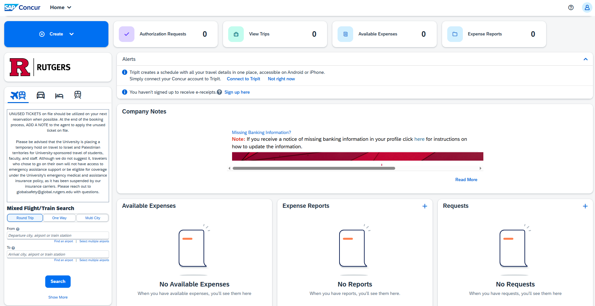

2. From home page/dashboard select create a request:

   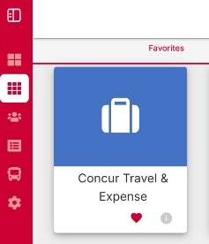

3. Complete header then select "create request":

   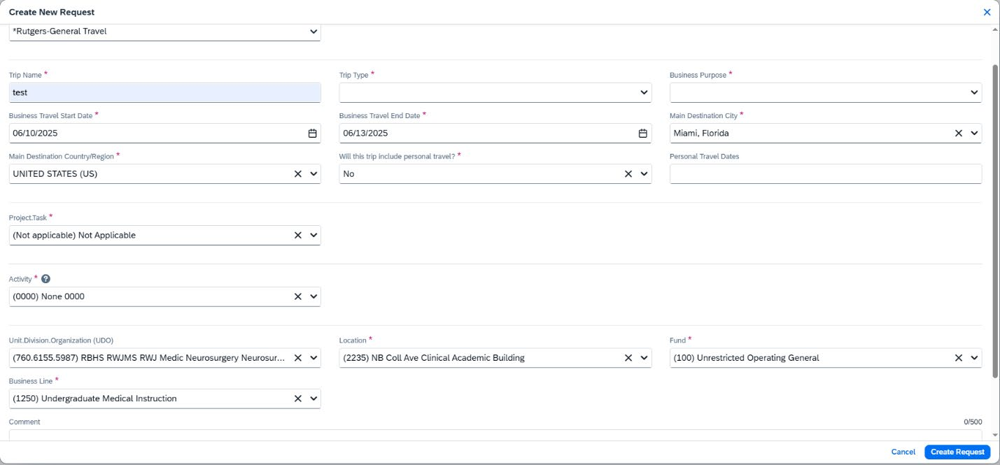

4. Add the estimated expenses for your trip (note: these can be estimates and do not need to match the report exactly):

   

5. Choose the expense type:

   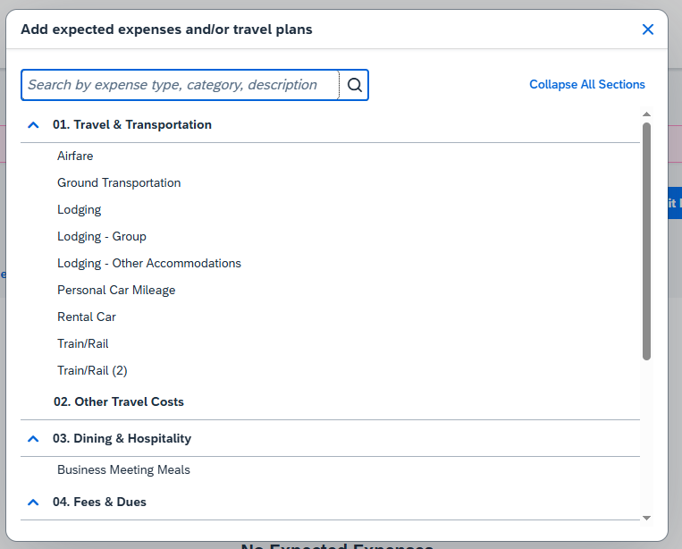

   **Note**: Accounting codes will be provided by Denise or Hillary.

6. Then add the required information and click "save". For example for airfare:

   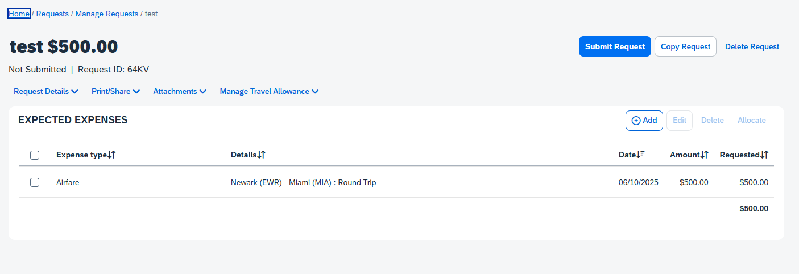

7. The expense will now be listed in your request. Add all expenses in this way then click "Submit Request":

   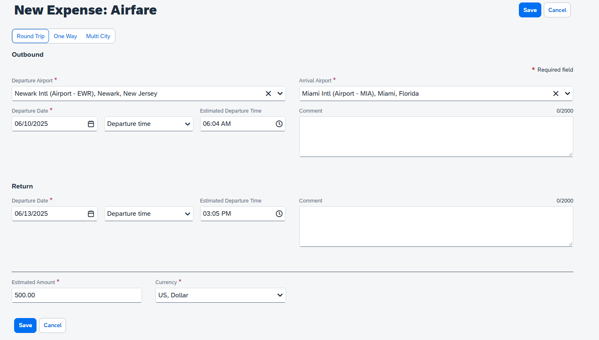

**Important**: Once approved, you must book your flights through Concur or through Direct Travel ((888) 818-1067, RutgersTravel@dt.com). Hotels and cars can also be booked through Direct Travel, but these may also be booked with your own travel agent or app. Be sure to save all receipts for your reimbursement report.

### Creating and Submitting a Travel Report

1. Open the approved request for the trip, click on "Create Expense Report" in the upper right:

   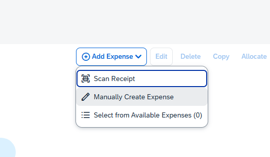

2. In the report you will now see the request attached:

   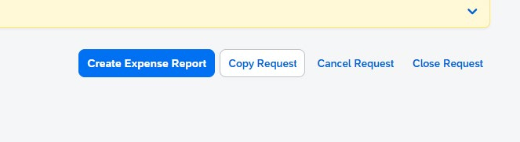

3. Add expenses as you did for the request using actual amounts and attach receipts:

   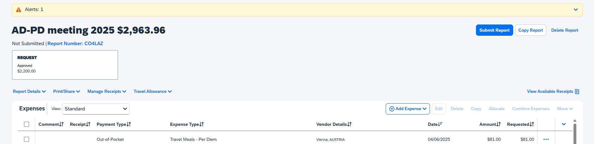

4. Some expenses will require you to name attendees. Click on "Attendees" and click on "Add". You can search for yourself then click "Add". You can also create a list of attendees here to add:

   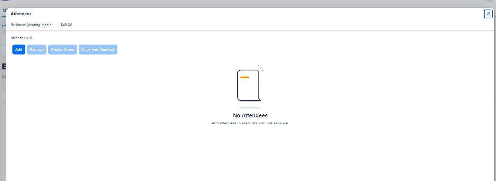
   

5. Add per diem expenses by selecting "Travel Allowance/Add Travel Allowance":

   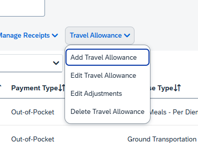

6. Add your travel itinerary:

   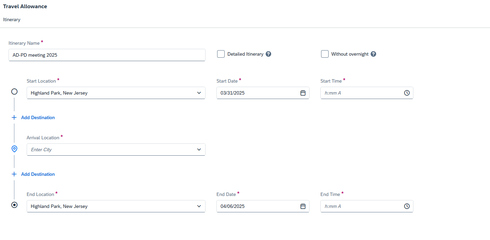

7. Subtract any meals that were provided by other sources (i.e. lunch provided at a conference) then click "Finish":

   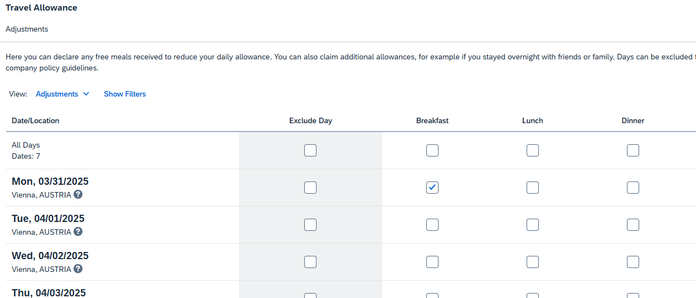

8. Resolve any red alerts (for example, be sure to add an agenda for the conference) then submit report:

   

9. Click "Submit Report" in the pop-up:

   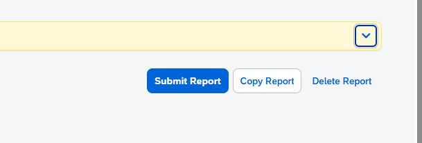

### Creating a Non-Travel Reimbursement Report

1. From myRutgers portal, go to apps and choose "Concur Travel and Expense":

   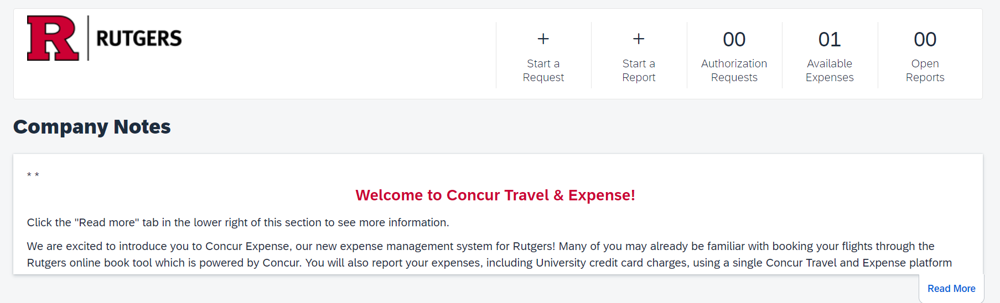

2. Log in to Concur and then start a report:

   

3. Complete the header information for the new report:
   - Click here to enter respective accounting codes in the boxes. Denise or Hillary can give you the proper codes.
   - Once completed, click "Next"
   - Choose "Non-Travel" reimbursement

   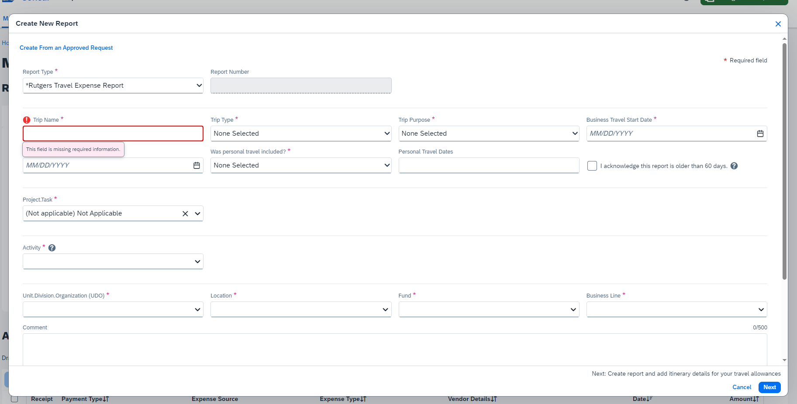

4. You will now see the new report with the title you named it. From here click "Add Expense":

   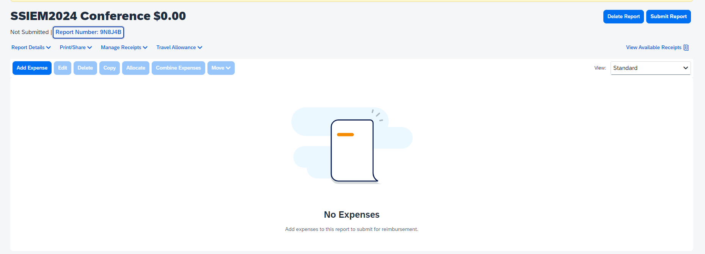

5. Click "Create New Expense" and choose the expense type:

   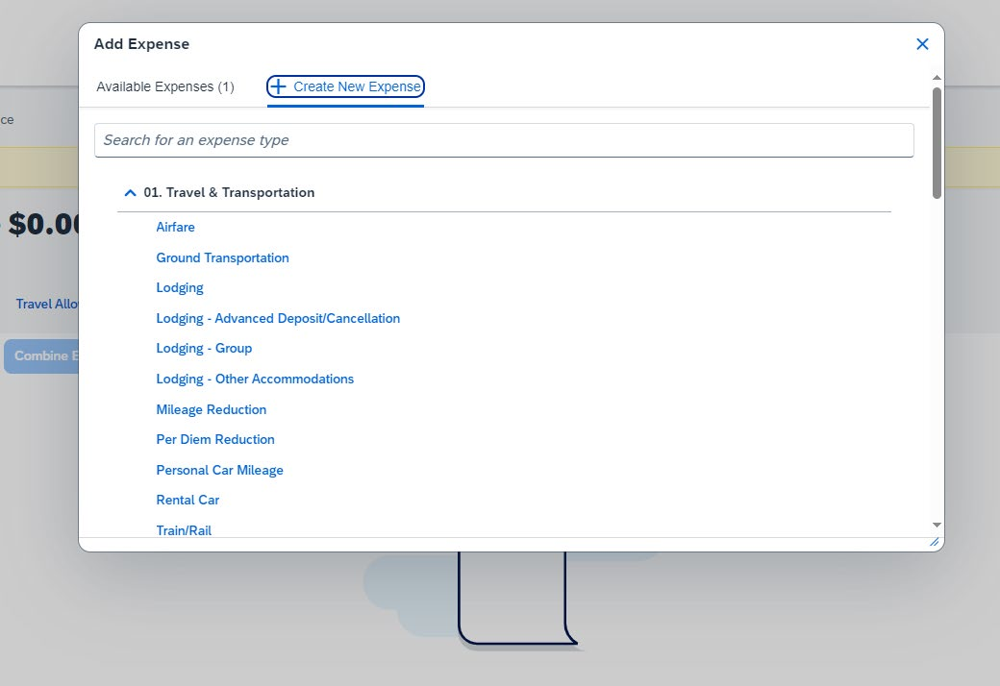

6. Fill in the information for the expense and upload the receipt:

   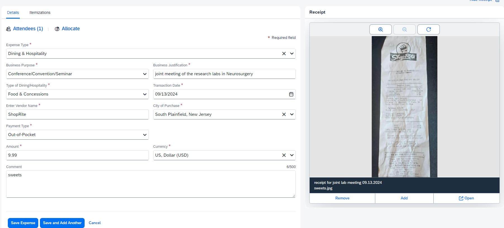

7. Some expenses will require you to name attendees. Click on "Attendees" and click on "Add". You can search for yourself then click "Add". You can also create a list of attendees here to add:

   
   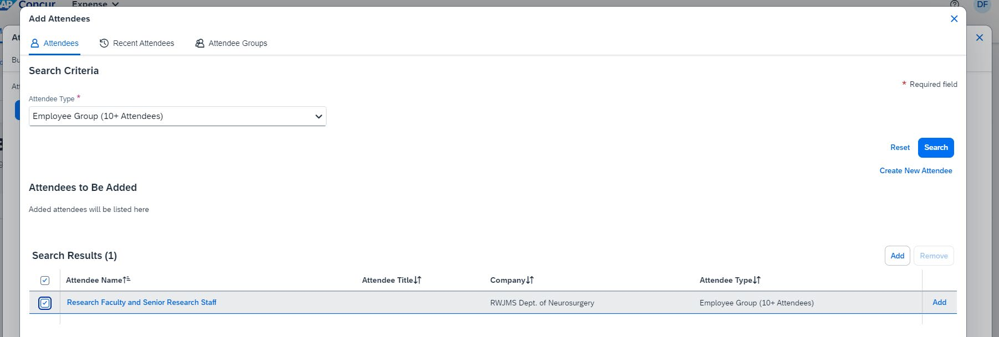

8. Once all expenses have been added you will see the expense list in your report like the following:

   

9. Click "Submit Report" and you will see the following pop-up:

   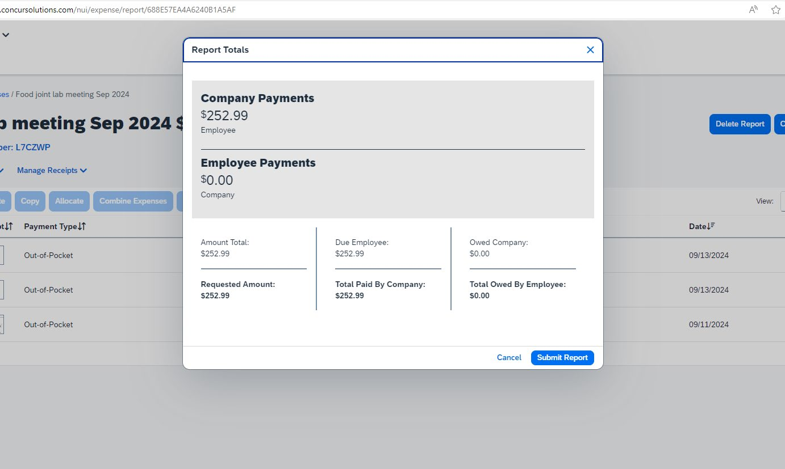

10. Click "Submit Report" in the pop-up.

---

## Forms

### Time-Off Request Form

For faculty travelers: Complete the departmental out of office form to report the time you will be traveling.

---

[Back to Protocols](README.md)
